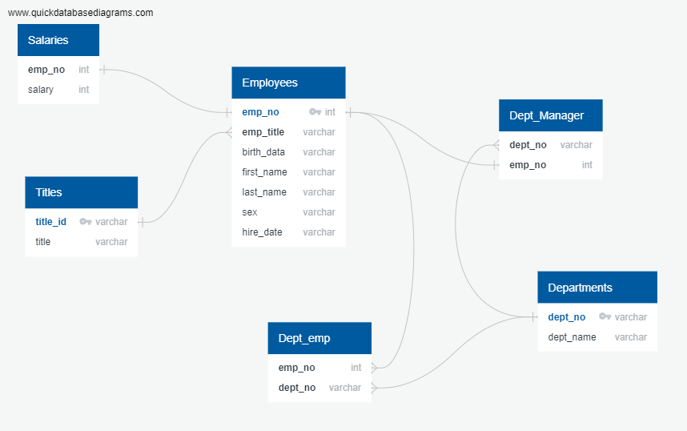
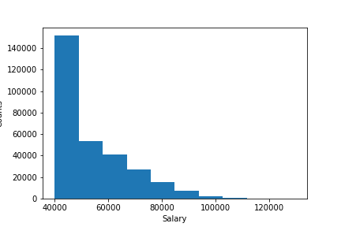
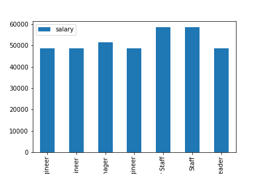

# sql-challenge

### VISUALIZATION
An initial review of the CSV files was made and each was charted with column names and types. 
Connections between the tables were charged in an ERD for database planning:

### SCHEMATA

 A new database was set up in Poatgres as sql_challenge_db.
 All CSV files were read in as tables.

 ### QUERIES

 Queries were made to answer the following questions:

 1. List the following details of each employee: employee number, last name, first name, sex, and salary.

 2. List first name, last name, and hire date for employees who were hired in 1986.

 3. List the manager of each department with the following information: department number, department name, the manager's employee number, last name, first name.

 4. List the department of each employee with the following information: employee number, last name, first name, and department name.

 5. List first name, last name, and sex for employees whose first name is "Hercules" and last names begin with "B."

 6. List all employees in the Sales department, including their employee number, last name, first name, and department name.

 7. List all employees in the Sales and Development departments, including their employee number, last name, first name, and department name.

 8. List the frequency count of employee last names (i.e., how many employees share each last name) in descending order.

 ### Bonus:
 
 Data was read into Pandas to allow visualization in the form of a histogram and a bar graph to explore salary ranges: 

 
 